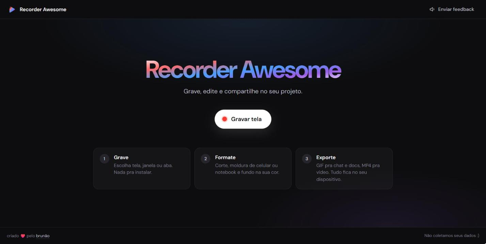

# Recorder Awesome

Grava tela no browser, edita (trim/crop), formata dentro de moldura (celular/notebook/borda) com background, e exporta em **GIF** ou **MP4**.

Alternativa ao gifcap.dev com personalização (mockups) e saída em MP4.

## Stack
- React + Vite + TypeScript
- Captura: `getDisplayMedia`
- Pipeline: Canvas + WebCodecs (Chrome/Edge)
- Export: GIF (`gifenc`) · MP4 (`mp4-muxer`)
- Deploy: Vercel

## Fluxo
`Grava → Edita → Formata → Output (GIF | MP4)`

Plano completo: [`docs/plan.md`](docs/plan.md).

> Status: em uso, com deploy na Vercel. Suporte só Chrome/Edge.

## Recursos

### Grava
- Captura de tela, janela ou aba, sem áudio.
- Indicador ao vivo e cronômetro durante a gravação.

### Edita
- **Trim** direto na timeline: alças de início e fim.
- **Playhead** acompanha o playback; clicar ou arrastar na timeline faz seek contínuo.
- **Recorte (crop)** de uma região da tela, com cantos ajustáveis.

### Formata
- **Moldura:** Nenhuma, Borda preta, Borda branca, Celular ou Notebook.
- **Radius:** controle deslizante (0–80px) que arredonda os cantos da gravação.
  Vale para Nenhuma e para as bordas; fica desabilitado em Celular e Notebook,
  que têm raio próprio. O valor é em px na resolução original da gravação.
- **Encaixe:** Fit (mostra o vídeo inteiro) ou Fill (preenche a tela da moldura, pode cortar).
- **Cor da tela:** cor das sobras do Fit dentro da moldura.
- **Respiro:** margem em volta da gravação, com cor de fundo ou transparente.
  Sem respiro, o fundo fica transparente (no MP4, que não tem alpha, vira branco).

### Exporta
- **GIF** ou **MP4** (H.264, 30 fps fixos, até 1920px no maior lado).
- **Velocidade:** 0.5×, 1×, 1.5× ou 2×.
- **Quadros por segundo** (só GIF): 10, 15, 20 ou 24.
- **Resolução:** Auto (reduz o GIF com downscale em etapas + nitidez, respeita o teto do formato), 100% ou 50%.
- Estimativa de dimensões, quadros e peso antes de baixar.
- Nome padrão do arquivo: `RecordingAwesome-AAAA-MM-DD_HH-MM-SS.<ext>`.

## Privacidade / LGPD

Por design, a ferramenta **não coleta nem transmite dados pessoais**:

- **100% local**: a gravação e todo o processamento (trim, crop, moldura, GIF/MP4)
  acontecem no navegador via Canvas/WebCodecs. Nenhum frame é enviado a servidor.
- **Sem rastreamento**: zero cookies, `localStorage`, analytics ou logs de usuário.
- **Permissões mínimas**: pede só captura de tela (`getDisplayMedia`), no clique do
  usuário, com o consentimento nativo do browser. Não pede microfone nem câmera
  (`audio: false`).
- **Sem terceiros**: a fonte DM Sans é self-hospedada em `/public/fonts` — nada é
  carregado de CDNs externas (evita transferir o IP do usuário ao Google Fonts).
- **Saída sob controle do usuário**: o arquivo final só sai via "Baixar", iniciado
  pelo próprio usuário.
